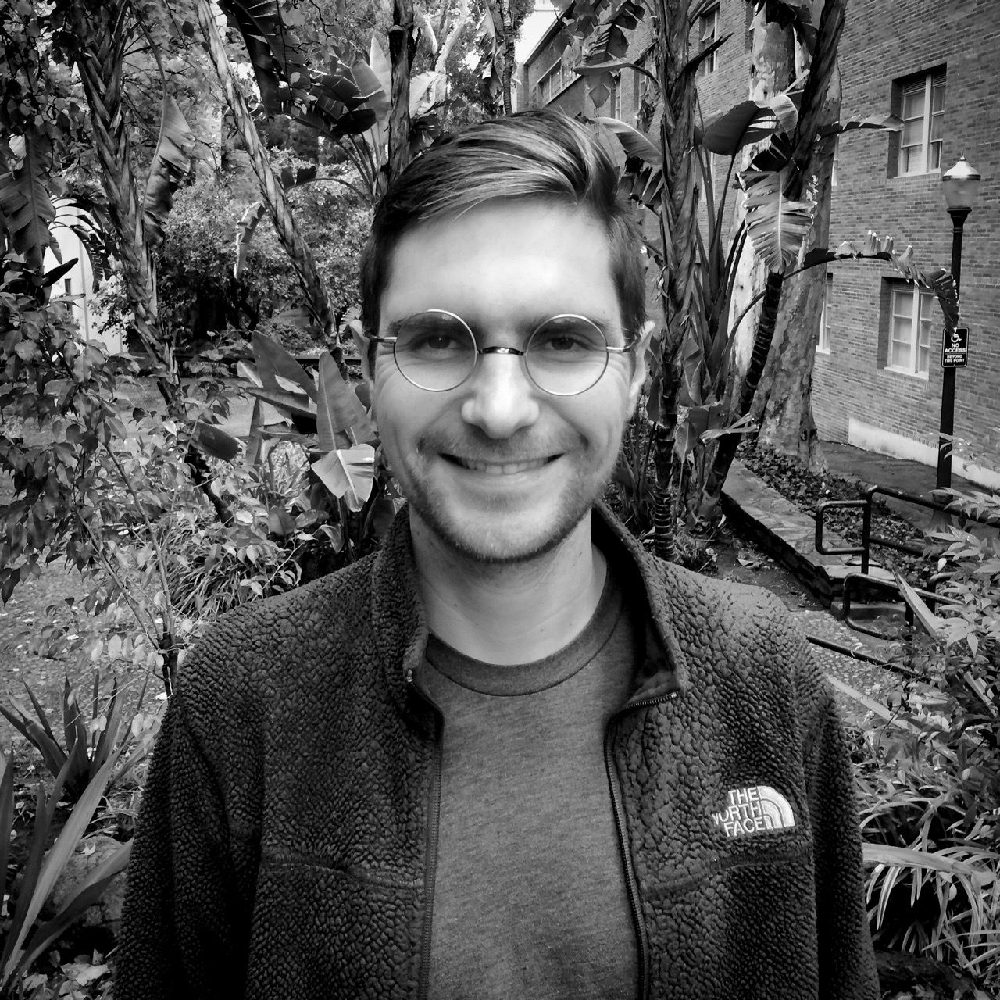

  Hi, I'm Baird.

:earth_africa: :earth_americas: :earth_asia:

I'm a climate scientist and postdoc in the UC Irvine [Department of Earth System Science](https://www.ess.uci.edu/).

I study land-atmosphere interactions as a joint member of the [Pritchard](http://sites.uci.edu/pritchard/) and [Randerson](http://sites.uci.edu/randersonlab/) research groups.  More specifically, I'm interested in how tropical forests respond to different types of land surface and environmental change, including increased carbon dioxide concentrations and deforestation.

Before arriving at UC Irvine, I received my PhD in the UCLA [Department of Atmospheric and Oceanic Sciences](https://www.atmos.ucla.edu/), where I worked in the [Climate Systems Interactions group](http://research.atmos.ucla.edu/csi//) led by [David Neelin](http://people.atmos.ucla.edu/neelin/).  I grew up in Tennessee and attended Brown University for college, where I majored in geophysics.

Download my cv <a href="https://bairdlangenbrunner.github.io/cv_baird.pdf" target="_blank">here</a>.

{::comment}
At UCI, I am studying the response of tropical forests (the Amazon and Indonesian archipelago) to different types of land surface and environmental change. Human activities like deforestation and carbon dioxide emissions alter energy and moisture fluxes at the land surface, which in turn can impact regional atmospheric dynamics, and I’m using WRF and CESM to better understand these interactions. More broadly, my current and previous research has been motivated by the goal of understanding and improving Earth system models so that they can be used to make better predictions of regional climate change and its societal impacts.
Download my cv [here](./cv_baird.pdf).
{:/comment}

{::comment}
This is the base Jekyll theme. You can find out more info about customizing your Jekyll theme, as well as basic Jekyll usage documentation at [jekyllrb.com](https://jekyllrb.com/)
You can find the source code for Minima at GitHub:
[jekyll][jekyll-organization] /
[minima](https://github.com/jekyll/minima)
You can find the source code for Jekyll at GitHub:
[jekyll][jekyll-organization] /
[jekyll](https://github.com/jekyll/jekyll)
[jekyll-organization]: https://github.com/jekyll
{:/comment}

{::comment}

{:height="250px" width="250px"}
{:left: style="text-align: left"}
{:left}
{:/comment}